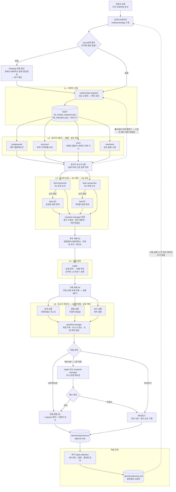

# 의사결정 흐름도 — 투자전략 트레이딩 하네스

[TradingAgents](https://github.com/tauricresearch/tradingagents) 구조를 이식한 파이프라인의 에이전트 의사결정 과정. 에이전트 11명이 5계층(데이터 고정 → 분석 → 리서치 토론 → 실행 설계 → 리스크 게이트)으로 분업하고, 의사결정 저널·복기가 학습 루프를 닫는다.

## 읽는 법

- **격리가 설계의 핵심이다.** L2 분석가 4명, L3의 R1 논지, L5의 3성향은 서로의 산출물을 보지 못한다. 독립 관점의 충돌이 정보량의 원천이며, 교차는 R2에서 오케스트레이터가 파일을 건네는 방식으로만 일어난다. 데이터 전달은 전부 `_workspace/` 파일 기반이다.
- **게이트가 두 번 있다.** trader의 손익비 1.5 게이트(미달이면 계획 자체를 내지 않고 "보류 + 성립 조건"이 결론)와 portfolio-manager의 최종 게이트(⛔치명 지적이 하나라도 있으면 APPROVE 불가). REVISE는 1회만 허용되고 미해소면 REJECT — 무한 루프 방지.
- **학습 루프가 시스템을 닫는다.** 모든 판정(거부 포함)이 journal에 append되고, 복기가 벤치마크 대비 알파 기준으로 의사결정 품질을 평가해(결과론 금지) lessons.md에 교훈을 쌓으며, 다음 실행에서 전 판단 에이전트가 이를 읽는다. Pending 자동 결산이 이 루프의 시작점을 자동화한다.

상세 실행 규칙은 `.claude/skills/trading-strategy/SKILL.md`(오케스트레이터), 각 단계 방법론은 해당 스킬(`market-snapshot`, `analyst-toolkit`, `research-debate`, `trade-planning`, `risk-gate`, `trade-reflection`) 참조.
