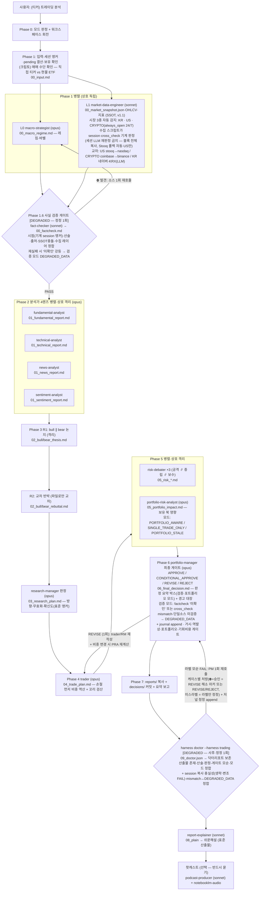
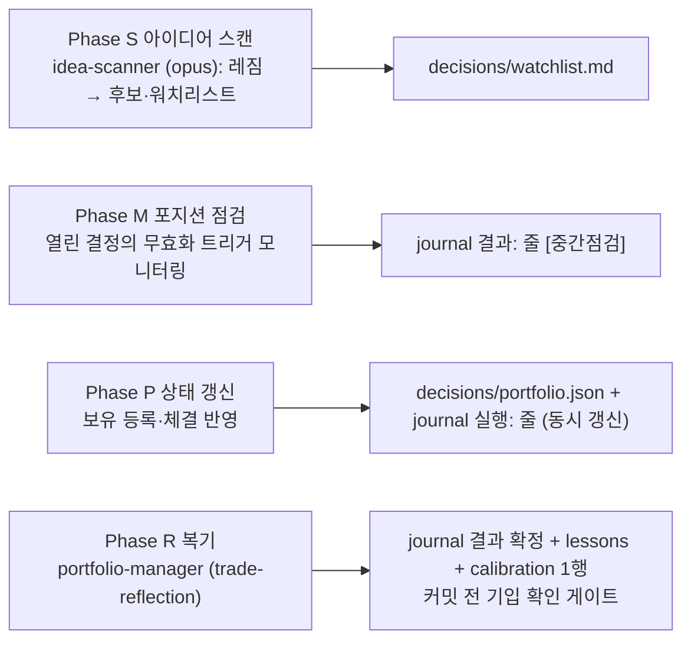
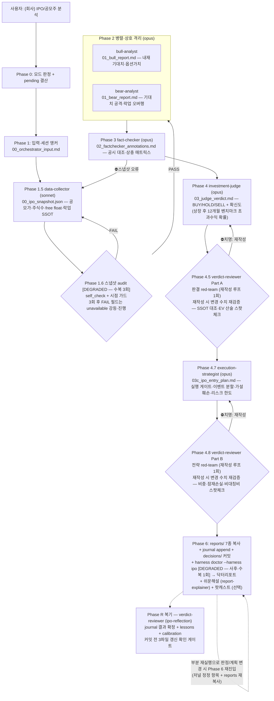
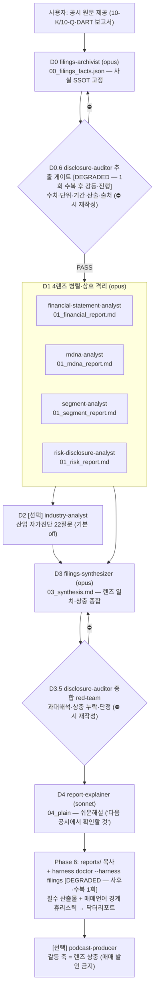
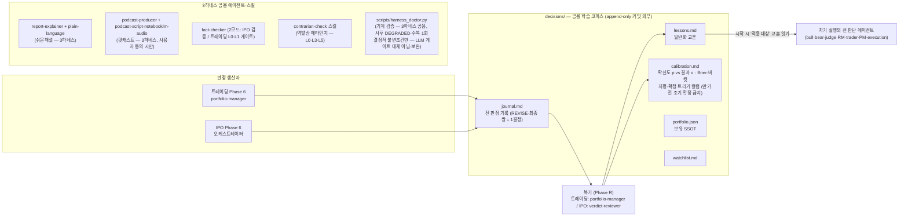

# Trading Agent — 3하네스 전체 구조 다이어그램

작성: 2026-07-04 (독립 검증 2라운드 완료 시점) · 갱신: 2026-07-05 (수집 레이어 기계 판정 — session 블록·이중 소스 교차·DEGRADED_DATA 체인 배선 + CRYPTO 시장 모드 — always_open 24/7·크립토 교차 체인). 규칙 상세는 각 오케스트레이터 스킬(`trading-strategy` / `ipo-analysis` / `filings-analysis`)이 SSOT — 이 문서는 구조 조감도다.

## 하네스 1: 투자전략 트레이딩 (trading-strategy)

14명 6계층 + 소싱·포트폴리오 레이어. L0∥L1 병렬 → 검증 게이트 → 4렌즈 팬아웃 → 2라운드 토론 → 거래 계획 → 리스크 4자 병렬 → PM 게이트 → 저널.

**별도 진입 모드:**

## 하네스 2: IPO 적대적 투자 분석 (ipo-analysis)

6전문가 파이프라인 + 학습 루프. 미국(EDGAR)·한국(DART) 범용.

## 하네스 3: 공시 보고서 체계 분석 (filings-analysis)

제공 파일만·이해 목적 — **매매 판단·저널 기록 없음** (매매 판단은 트레이딩 하네스로).

## 공용 자산 · 학습 루프 (트레이딩 + IPO)

**격리 원칙 요약:** Bull↔Bear(R1)·리스크 3성향·4렌즈는 서로의 산출물을 보지 않는다(독립 관점 = 정보량). 데이터 전달은 워크스페이스 파일로만(트레이딩 `_workspace/`, IPO `_workspace_ipo/`, 공시 `_workspace_filings/`). 생성-검증 분리: 자기 산출물을 자기가 검증하지 않는다(fact-checker·verdict-reviewer·disclosure-auditor가 격리 검증).
