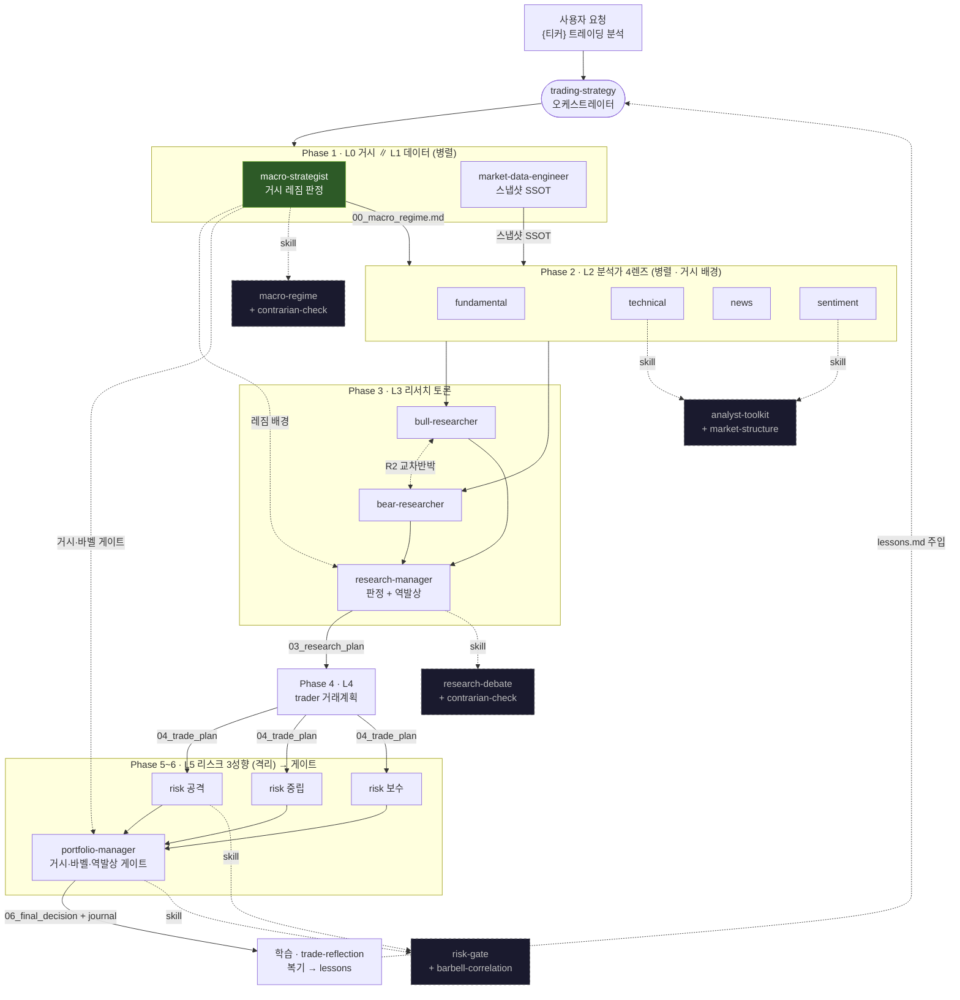

# 트레이딩 하네스 전체 구조 (뉴로퓨전/월가아재 톱다운 보강 후)

> 12명 6계층. 2026-06-14 보강(L0 거시 레짐 + 바벨·상관 + 시장구조 + 역발상).
> 실선 = 데이터 흐름(파일), 점선 = 스킬 참조, `<-.->` = R2에서만 교차(R1은 격리).

## 계층 요약

| 계층 | 에이전트 | 산출물 | 스킬 |
|------|---------|--------|------|
| L0 거시 | macro-strategist | `00_macro_regime.md` | macro-regime, contrarian-check |
| L1 데이터 | market-data-engineer | `00_market_snapshot.json` 외 | market-snapshot |
| L2 분석 | fundamental ∥ technical ∥ news ∥ sentiment | `01_*_report.md` | analyst-toolkit (+market-structure) |
| L3 리서치 | bull ↔ bear → research-manager | `02_*`, `03_research_plan.md` | research-debate, contrarian-check |
| L4 실행 | trader | `04_trade_plan.md` | trade-planning |
| L5 게이트 | risk ×3 → portfolio-manager | `05_risk_*`, `06_final_decision.md`, journal | risk-gate (+barbell-correlation), contrarian-check |
| 학습 | portfolio-manager(복기) | `decisions/lessons.md` | trade-reflection |

방법론 원천: `docs/neurofusion/method_{liquidity_fed,macro_regime,structure_valuation,portfolio_risk}.md`
